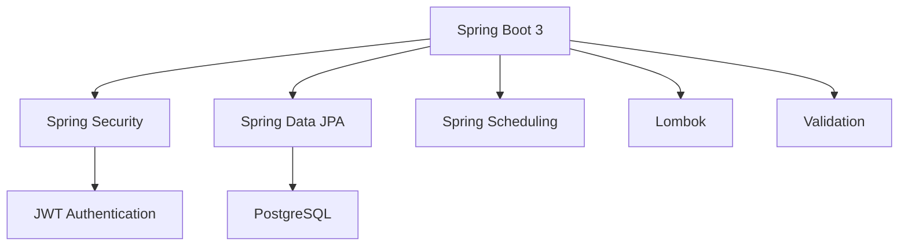

# Система управления банковскими картами


> **Статус проекта**: В разработке  
> **Последнее обновление**: 1 июля 2025

Микросервис для управления банковскими картами с безопасным доступом, переводами и автоматическим контролем статусов карт. Реализовано 80% функционала.

##  Запуск приложения

### Требования
- Java 17+
- PostgreSQL 14+
- Maven 3.8+

### Конфигурация
Создайте `application.properties`:
```properties
spring.datasource.url=jdbc:postgresql://localhost:5432/bankcards
spring.datasource.username=postgres
spring.datasource.password=0
spring.jpa.hibernate.ddl-auto=update

jwt.secret=your-strong-secret-key-512-bit-length
jwt.expiration-ms=900000 # 15 мин
```

### Сборка и запуск
```bash
mvn clean package
java -jar target/bankcards-0.0.1-SNAPSHOT.jar
```

##  Документация API

###  Аутентификация

| Метод | Эндпоинт              | Описание                | Статус |
|-------|------------------------|-------------------------|--------|
| POST  | `/api/auth/login`      | Вход в систему          | ✅     |
| POST  | `/api/auth/register`   | Регистрация пользователя| ✅     |
| POST  | `/api/auth/register-admin` | Регистрация админа   | ✅     |

**Пример запроса:**
```json
POST /api/auth/login
{
  "username": "user@example.com",
  "password": "password123"
}
```

###  Управление пользователями (ADMIN)

| Метод | Эндпоинт              | Описание                | Статус |
|-------|------------------------|-------------------------|--------|
| GET   | `/api/users`           | Все пользователи        | ✅     |
| GET   | `/api/users/{id}`      | Получить пользователя   | ✅     |
| DELETE| `/api/users/{id}`      | Удалить пользователя    | ✅     |

###  Управление картами

| Метод | Эндпоинт                     | Описание                          | Доступ | Статус |
|-------|------------------------------|-----------------------------------|--------|--------|
| POST  | `/api/cards`                 | Создать карту                    | USER   | ✅     |
| GET   | `/api/cards`                 | Все карты (ADMIN)                | ADMIN  | ✅     |
| GET   | `/api/cards/my`              | Мои карты                        | USER   | ✅     |
| GET   | `/api/cards/{id}`            | Получить карту по ID              | USER   | ✅     |
| GET   | `/api/cards/user/{userId}`   | Карты пользователя (ADMIN)       | ADMIN  | ✅     |
| DELETE| `/api/cards/{id}`            | Удалить карту                    | USER   | ✅     |
| PATCH | `/api/cards/{id}/block`      | Заблокировать карту              | ❌     | 🚧     |
| PATCH | `/api/cards/{id}/activate`   | Активировать карту               | ❌     | 🚧     |

**Пример создания карты:**
```json
POST /api/cards
Authorization: Bearer <token>
{
  "cardNumber": "4111111111111111",
  "ownerName": "IVAN IVANOV",
  "expiryDate": "2026-12-31",
  "balance": 1500.00,
  "userId": "3fa85f64-5717-4562-b3fc-2c963f66afa6"
}
```

###  Управление переводами

| Метод | Эндпоинт              | Описание                | Доступ | Статус |
|-------|------------------------|-------------------------|--------|--------|
| POST  | `/api/transfers`       | Создать перевод         | USER   | ✅     |
| GET   | `/api/transfers`       | Все переводы (ADMIN)    | ADMIN  | ✅     |
| GET   | `/api/transfers/user/{userId}` | Переводы пользователя | ADMIN  | ✅     |

**Пример перевода:**
```json
POST /api/transfers
Authorization: Bearer <token>
{
  "fromCardId": "3fa85f64-5717-4562-b3fc-2c963f66afa6",
  "toCardId": "a0eebc99-9c0b-4ef8-bb6d-6bb9bd380a11",
  "amount": 500.00
}
```

##  Обработка ошибок
Система возвращает структурированные ответы при ошибках:

```json
{
  "message": "Card not found",
  "timestamp": "2025-07-02T12:34:56Z"
}
```

**Коды ошибок:**
- 400 Bad Request - Ошибка валидации
- 401 Unauthorized - Не авторизован
- 403 Forbidden - Доступ запрещен
- 404 Not Found - Ресурс не найден
- 409 Conflict - Конфликт данных
- 500 Internal Server Error - Серверная ошибка

##  Текущие ограничения
1. **Не реализовано:**
    - Шифрование номеров карт в БД
    - Swagger документация
    - Liquibase миграции
    - Docker окружение
    - Блокировка/активация карт через API

2. **Частично реализовано:**
    - Автоматическое обновление статусов карт (шедулер работает, но требует оптимизации)
    - Проверка прав доступа (требует доработки для некоторых сценариев)

## 🛠 Технологический стек


##  Следующие шаги разработки
1. Реализовать шифрование данных карт
2. Добавить Swagger документацию
3. Настроить Liquibase миграции
4. Создать Docker окружение
5. Реализовать эндпоинты блокировки/активации карт
6. Добавить интеграционные тесты


## Ключевые особенности текущей реализации:

### ✅ Реализовано
- **Аутентификация**: JWT с ролями USER/ADMIN
- **Базовое управление**: Карты, пользователи, переводы
- **Автоматические проверки**:
  - Статус карты (активная/просроченная)
  - Достаточность средств при переводе
  - Права доступа к операциям
- **Пагинация**: Во всех списковых запросах
- **Валидация**: Запросов через Jakarta Validation
- **Маскирование данных**: Номера карт в ответах
- **Глобальная обработка ошибок**

###  В процессе
- **Шедулер обновления статусов**: Требует оптимизации
- **Проверка прав доступа**: Не для всех сценариев
- **Тестирование**: Частичное покрытие

###  Не реализовано
- Шифрование чувствительных данных в БД
- Документация API (Swagger)
- Миграции баз данных (Liquibase)
- Docker окружение
- Полное покрытие тестами

Для использования API:
1. Зарегистрируйте пользователя через `/api/auth/register`
2. Авторизуйтесь через `/api/auth/login`
3. Используйте полученный токен в заголовке `Authorization: Bearer <token>`
4. Выполняйте запросы к защищенным эндпоинтам 
